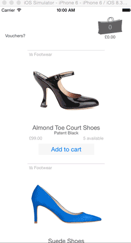

# eCommerce demo in Swift gif demo

# Description

This is a single page app with two views: products and vouchers. Both are laid out as collection views for extendability. Actual products and vouchers are table files that feed a "cart brain" file and the collection views.

The vouchers have been implemented just like products, to be added or removed manually, because the user story specified that we needed to raise errors if the wrong voucher was applied. In real life, I would have tried to go back to the client with a case to narrow the possibilities for annoying the customer, and request to make the vouchers automatically applicable with a positive message shown.

I chose not to use the UIAlertController for the voucher and stock check error messages, as I wanted to keep the design subtle and the scolding of the user to a minimum.

The app looks as good in portrait or landscape, on any iPhone or iPad device. Much time was spent with Autolayout.

Testing is done with automation using <a href="https://github.com/james-miller/eyeTest">the new eyeTest tool</a>, which uses Javascript instructions via Instruments to automate the testing of the user stories, in RSpec style. While building the tests, I added some of my own collection view test methods, but unfortunately the automated scrolling function doesn't scroll far enough to pass my stock check user story. You can see this functionality working in the simulator.

## Technical improvements:
The brief did not require use of a database but, after building, I think it must be easier to use CoreData or a Rails back end to share the cart and stock information. I am particularly unhappy with calling two instantiations of ProductList() (one in the Cart Brain and one in ProductViewController). 

## Future plans, extending the brief:
 - build the buy/checkout screen
 - add a + sign to the products so that users could add more than one of the same product
 - for less scrolling, add gender and category filters at the top of the screen

## To install and run the simulator
- with Xcode installed
- in terminal: `git clone git@github.com:saramoohead/ecommerce_exercise.git`
- open Xcode
- open `eCommerceExercise.project`
- run the build into the simulator with the device of your choice

## To install and run the feature tests (gif demo below)
- after the project has been successfully built into the simulator, shortcut: `⌘R`
- stop the simulator, shortcut: `⌘.`
- launch Instruments, shortcut: `⌘i`
- choose Automation
- go to the Display Settings tab in bottom right corner, shortcut `⌘2`
- select `Add` then `Import` and choose the `featureTest.js file`
- the script will appear in the bottom left window
- hit the play button at the bottom of the screen to see the test messages

